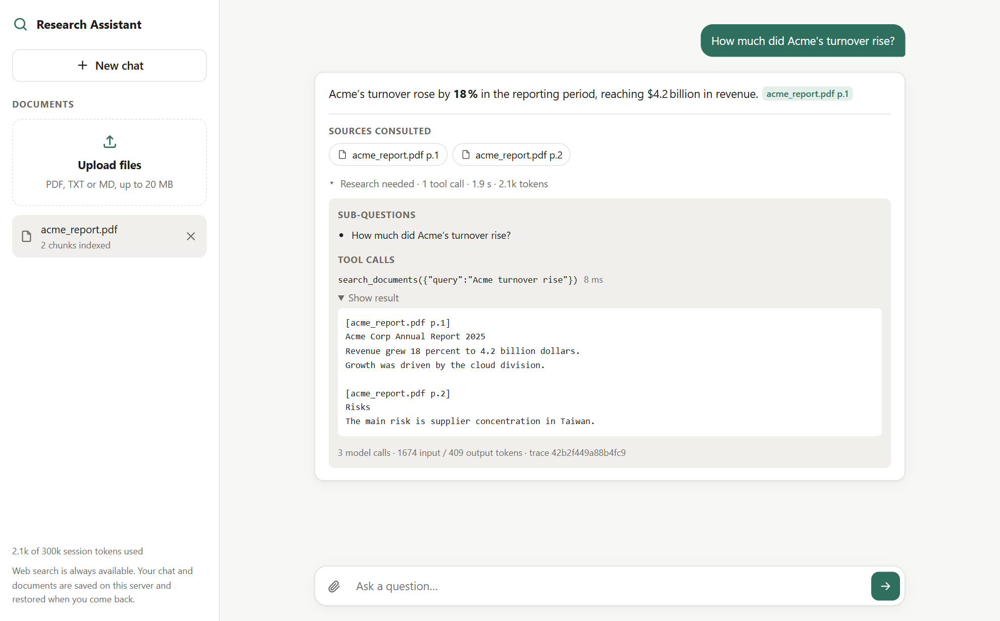

# Agentic Research Assistant

A research agent that answers questions from **your documents** and **the web**, shows its
work as it goes, and **checks every citation in code** before an answer reaches you.



- **Ask about your files or the world.** Attach PDFs, text or Markdown files with the **+**
  button (or drag and drop), or just ask. The agent chooses among eight tools: document
  search and reading, web search and page fetching, Wikipedia, arXiv, world time, and place lookup.
- **See how it got there.** Progress streams live (which tool it's using, for what), and every
  answer carries its sources and a trace of each tool call, its raw result, timing and token usage.
- **Citations you can trust.** A citation that no retrieved passage supports is removed
  automatically, and you're told. On the evaluation set, citation precision was 100%.
- **Built for deployment.** PostgreSQL or SQLite persistence, API-key auth, rate limits and token
  budgets, SSRF-safe web access, prompt-injection guardrails, Prometheus metrics, Docker and CI.

**Evaluation (17 questions, synthetic corpus):** 100% correct, 94% faithful and 100% citation
precision with hybrid retrieval. Keyword search alone scored 88% correct.
[Details →](docs/evaluation.md)

## Quick start

You need Python 3.11+ and a free [Groq API key](https://console.groq.com/keys).

```bash
python -m venv venv
venv\Scripts\activate                 # macOS/Linux: source venv/bin/activate
pip install -r requirements.txt
copy .env.example .env                # macOS/Linux: cp .env.example .env, then set GROQ_API_KEY
python main.py                        # opens http://127.0.0.1:8000
```

With no other settings it stores data in SQLite under `data/`, needs no other services, and
downloads the embedding model (~67 MB) on first start.

**Or with Docker** (app plus PostgreSQL 16):

```bash
docker compose up --build             # http://127.0.0.1:8000
```

## Using it

| To… | Do this |
|---|---|
| Ask about a document | Click **+** in the message box (or drop files anywhere), wait for the chip to show its chunk count, then ask. Send with no text to get a summary. |
| Research the web | Just ask. The router decides whether a question needs research. |
| Check the evidence | Click a citation badge such as `[W1]` to open the source, or expand the trace under the answer to see every tool call and its raw output. |
| Stop an answer | Press the stop button while it's working. Nothing from that turn is saved. |
| Start over | **New chat** clears the conversation; your documents stay. |

Your chat and documents are saved on the server and restored when you reload the page.

## Documentation

| Guide | What's in it |
|---|---|
| [Architecture](docs/architecture.md) | How a question becomes an answer: routing, the tool loop, hybrid retrieval, citation checking, persistence, and the design decisions behind them |
| [Configuration](docs/configuration.md) | Every environment variable, with defaults |
| [API reference](docs/api.md) | REST and streaming endpoints, event formats, errors, `curl` examples |
| [Deployment](docs/deployment.md) | Docker, PostgreSQL, security checklist, monitoring, troubleshooting |
| [Evaluation](docs/evaluation.md) | Methodology, results and how to run the harness |
| [Development](docs/development.md) | Project layout, tests, adding a tool, conventions |

## Tech stack

| Layer | Technology |
|---|---|
| Model | `openai/gpt-oss-20b` on Groq, via LangChain |
| Retrieval | BM25 plus `bge-small-en-v1.5` embeddings (fastembed/ONNX, no PyTorch), fused with reciprocal rank fusion |
| Server | FastAPI with Server-Sent Events streaming, uvicorn |
| Storage | PostgreSQL 16 (psycopg 3 connection pool) or SQLite |
| UI | Vanilla JavaScript single page (no build step), marked and DOMPurify |
| Tooling | pytest (141 offline tests), ruff, Docker, GitHub Actions |

## Status and limitations

This is a portfolio-grade project, not a hosted product.
- Retrieval runs in memory per session, so very large document sets would need pgvector (on the roadmap).
- The free Groq tier limits each request to ~8K tokens and each day to 200K tokens.
- Scanned PDFs need OCR before upload.
- Open-Meteo's geocoding API, used by the time and place tools, is free for non-commercial use only.

Roadmap:
- [ ] Claim-level verification at answer time, not just in evaluation
- [ ] Research each sub-question independently with a planner (LangGraph)
- [ ] Server-side vector search with pgvector
- [ ] OCR for scanned PDFs
- [ ] A larger, human-labelled evaluation set
