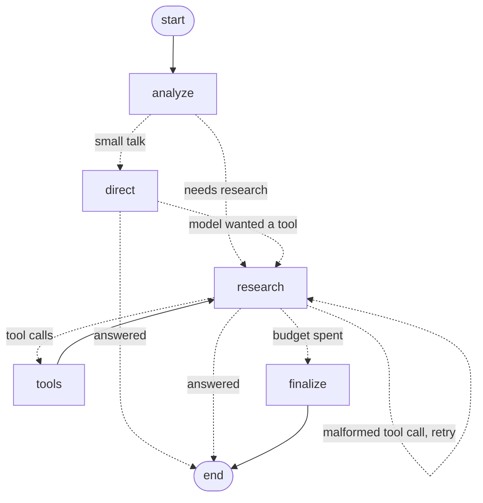

# Architecture

This page follows one question from the browser to a verified answer, then explains the
design decisions behind each part.

## Overview

```
Browser ──SSE──► FastAPI ──► SessionManager (LRU cache) ◄──► PostgreSQL / SQLite
   │               │                │                          sessions, turns,
   │  auth · rate limits · CSP      ▼                          chunks + vectors
   │  request ids · metrics   ResearchAgent.astream()  ── runs a LangGraph StateGraph
   │                                │
   │                ┌───────────────┴──────────────────┐
   │                ▼                                  ▼
   │       1. Query analysis                 2. Tool loop (≤ 5 rounds, concurrent calls)
   │          needs_retrieval?                  documents · web · Wikipedia · arXiv
   │          sub-questions                     · time · places
   │                │                              output fenced as untrusted data
   │                ▼                                  ▼
   └──── progress events ◄──── 3. Streamed answer ──► 4. Citation check ──► TurnResult
```

The agent package (`agent/`) has no web dependencies; the server (`web/`) wraps it. The same
agent runs in the web app, the evaluation harness and the tests.

## The agent graph

Each turn runs a [LangGraph](https://langchain-ai.github.io/langgraph/) `StateGraph`, defined in
[`research_agent.py`](../agent/research_agent.py). LangChain still provides the building blocks
(the Groq chat model, prompts, tools and message types); LangGraph orchestrates them.



| Node | Does | Next |
|---|---|---|
| `analyze` | Structured routing: `needs_retrieval`, sub-questions | `direct` or `research` |
| `direct` | Answers with no tools bound | end; or `research` if Groq reports the model tried to call a tool |
| `research` | One model call with tools bound; counts rounds | `tools`, end, a retry of itself after a rejected tool call, or `finalize` when `max_tool_iterations` is spent |
| `tools` | Runs every requested call concurrently; one `ToolMessage` each | `research` |
| `finalize` | Final answer with no tools, then a nudge, then a fallback | end |

**State** (`TurnState`) holds the conversation (with LangGraph's `add_messages` reducer), the
routing analysis, prompt variables, the round counter, the dedup keys of tool calls already made
(an append reducer), and `next`, which each node sets and the conditional edges read.
**Runtime context** (`TurnContext`, passed via `context_schema`) carries per-turn bookkeeping that
isn't conversation state: trace ID, token usage, tool timings, injection flags and warnings.

**Streaming.** Nodes emit progress with LangGraph's `get_stream_writer()`. `astream()` runs the
graph with `stream_mode=["custom", "values"]`, forwarding custom events to callers and keeping the
last state snapshot.

**Commit on completion.** The graph starts from a copy of the conversation plus the new question.
`agent.messages` is replaced with the graph's final messages only after the graph finishes. If a
node raises, or the caller stops iterating (the browser disconnects or the user presses stop),
nothing is committed, so history can never hold half a tool exchange.

The graph is exposed as `agent.graph`; `agent.graph.get_graph().draw_mermaid()` renders it.

## A turn, step by step

### 1. Query analysis (routing)

[`research_agent.py`](../agent/research_agent.py) first asks the model for a structured
`QueryAnalysis`:

```json
{"needs_retrieval": true, "sub_questions": ["What was Acme's revenue growth?", "What is its main risk?"]}
```

- **No retrieval needed** (greetings, rephrasing, general knowledge): the model answers
  directly with no tools bound, which saves the ~150 tokens each tool schema costs.
- **Retrieval needed**: go to the tool loop.
- **Routing fails** (API error, unparseable output): default to research. Routing is an
  optimisation, so failing safe means doing more work, not less.

The last few turns of conversation are included, so follow-ups like "what about its risks?" resolve.

### 2. The tool loop

The model is called with the relevant tools bound. For each round (at most
`max_tool_iterations`, default 5):

1. The model streams a response. If it asks for tools, any text it streamed first is discarded
   with a `reset` event.
2. All requested tool calls run **concurrently** (`asyncio.gather`), each with a timeout (30 s).
3. Every call gets exactly one `ToolMessage` reply, including skipped duplicates, unknown tools
   and errors. Chat APIs reject a history where a tool call has no reply.
4. Tool output is wrapped in `<tool_output>` tags, and text that looks like instructions to the
   model is flagged ([guardrails](#guardrails)).

When the budget runs out, the model is asked for a final answer with no tools bound. If it still
tries to call a tool, it gets one explicit "answer from what you found" nudge, then a fallback message.

**Document tools are only bound when documents exist**, and the prompt names only the tools
that are bound (see [gpt-oss quirks](#working-around-gpt-oss-on-groq)).

### 3. Streaming

`ResearchAgent.astream()` yields events as the graph runs:

```
analysis → tool_start → tool_end → … → token → token → … → done
```

The SSE endpoint forwards them, the JSON endpoint collects them, and the evaluation harness
consumes them. `done` is emitted after the graph finishes and history is committed (see
[commit on completion](#the-agent-graph)).

### 4. Citation check

[`citations.py`](../agent/citations.py) runs after the answer is complete:

- Every document citation (`[report.pdf p.3]`, `[notes.md]`) is checked against the passages the
  tools returned **in this turn**. Unsupported citations are removed from both the answer and the
  stored history, and listed in `removed_citations` so the UI can show a notice.
- gpt-oss's `【…】` brackets are normalised, and pseudo-citations such as `【get_time】` are dropped.
- The **Sources consulted** list is built from tool output, not from what the model says it used.

The result is a `TurnResult`: answer, routing analysis, tool-call trace, sources, removed citations,
warnings, token usage, latency and a trace ID.

## Tools

| Tool | Source | Safeguards |
|---|---|---|
| `search_documents` | Uploaded files, hybrid search | Top-k capped; each passage labelled with its citation tag |
| `read_document` | Uploaded files, a whole page or file | Overlapping chunks re-stitched by offset; capped at 6k characters |
| `web_search` | DuckDuckGo, then fetches each result page | Cached; falls back to the search snippet if a page is unreachable |
| `fetch_url` | Any public web page | SSRF guard (below); 2 MB download cap; HTML reduced to readable text |
| `wikipedia_search` | Wikipedia API | Cached; ranked article introductions, cited `[W1]` |
| `arxiv_search` | arXiv API | Cached; titles, authors, dates, abstracts, cited `[A1]` |
| `get_time` | IANA timezone database, places resolved via Open-Meteo | Time comes from the server clock; accepts "Tokyo" or "Europe/Paris" |
| `place_info` | Open-Meteo geocoding (GeoNames data) | Cached; ambiguous names return several matches, cited `[P1]` |

All HTTP tools share [`tools/http.py`](../agent/tools/http.py):
- connection pooling and a 10-minute TTL cache;
- two bounded retries on 429/5xx, with `Retry-After` deliberately ignored so a throttled API
  can't stall a turn past its timeout;
- **SSRF protection**: only http(s); the hostname is resolved and rejected if any address is
  non-public (loopback, private ranges, link-local such as the cloud-metadata address
  `169.254.169.254`); redirects are followed manually and every hop is re-checked.

## Retrieval

[`documents/`](../agent/documents/) handles ingestion and search.

**Ingestion.**
- PDFs are read page by page with pypdf; TXT and MD files are read as UTF-8.
- **OCR.** A PDF page with under 20 characters of extractable text is treated as a scan: it's
  rendered at 200 DPI with pypdfium2 and read by RapidOCR (PaddleOCR models on the ONNX runtime the
  embeddings already use, so there's no system Tesseract to install). Images (PNG, JPG, WebP, TIFF)
  go straight to OCR. Lines under 0.5 confidence are dropped, OCR'd chunks carry
  `metadata["ocr"] = True` (the UI labels them), and at most `OCR_MAX_PAGES` pages per document
  are OCR'd. The models load on first use and are shared behind a lock.
- Text is cleaned (joined hyphenation, collapsed whitespace), then split into 1,000-character
  chunks with 150-character overlap.
- **Chunks never cross page boundaries**, so every chunk cites exactly one page.
- Blank, corrupt and encrypted files, and scans in which OCR finds nothing, produce clear errors.

**Hybrid search.** Each query is ranked two ways, then fused:

| Ranker | Good at | Implementation |
|---|---|---|
| BM25 | Exact terms: names, numbers, codes | Lucene IDF variant, which stays positive even for a one-chunk file (classic Okapi IDF goes to zero) |
| Dense vectors | Paraphrases: "turnover" ↔ "revenue", "R&D" ↔ "research and development" | `bge-small-en-v1.5` via fastembed (ONNX, no PyTorch); cosine similarity |

The two rankings are combined with **reciprocal rank fusion** (k = 60), which needs no score
normalisation. Indexes are immutable snapshots swapped in one assignment, so a search never sees
a half-built index. If the embedding model can't load, search degrades to BM25 alone.

**Where the vectors live.**

| | In memory (SQLite, or Postgres without pgvector) | pgvector (Postgres with the extension) |
|---|---|---|
| Dense search | NumPy dot product over the session's vectors | `ORDER BY vec <=> query LIMIT 20` on an HNSW cosine index, filtered by session |
| Vectors in RAM | Yes, for every active session | No; restored sessions load only chunk text |
| Stored as | Raw float32 bytes | `vector(EMBEDDING_DIM)` column |
| Shared across instances | Rebuilt per instance | One index for all instances |

pgvector is detected at startup: the extension is created, the column and HNSW index are added,
and any vectors stored as raw bytes before it was enabled are migrated into the column. Results
map back to in-memory chunks by `chunk_id`. With pgvector ≥ 0.8, queries set
`hnsw.iterative_scan = relaxed_order`, so the per-session filter can't leave fewer results than
requested. If the extension is missing, lacks privileges, or the column was created for a different
embedding size, the server logs a warning and uses in-memory search instead of failing.

## Persistence and sessions

[`storage.py`](../web/storage.py) implements one query layer over two backends:

| | SQLite | PostgreSQL |
|---|---|---|
| Selected by | default | `DATABASE_URL=postgresql://…` |
| Vector search | in memory | pgvector when installed, otherwise in memory |
| Connections | one per operation (thread-safe) | psycopg 3 pool |
| JSON columns | TEXT | JSONB |
| Migrations | idempotent, on startup | idempotent, on startup, under an advisory lock so concurrent instances don't race |

Stored per session: the owner (a hash of the API key), the message history, each turn's question,
attachments and full `TurnResult`, and every chunk **with its embedding vector** (as a pgvector
`vector` when available, raw bytes otherwise).

[`sessions.py`](../web/sessions.py) keeps live agents in an LRU cache (50 by default). The database
is the source of truth: an evicted session, or any session after a restart, is rebuilt from
storage on its next request. Documents are never re-embedded: stored vectors are either loaded
(in-memory mode) or left in the database and queried there (pgvector). Sessions
idle for `SESSION_TTL_DAYS` are purged on startup.

Each session has an `asyncio.Lock`. A second message while one is in progress gets `409`, and
uploads wait for the current turn to finish.

## Guardrails

Web pages and uploaded files can contain text written to manipulate the model. The defences are layered:

1. **Spotlighting.** Tool output is wrapped in `<tool_output tool="…">`, and any fake closing tag
   inside it is neutralised. The system prompt says content inside those tags is data, never instructions.
2. **Tripwire.** Patterns such as "ignore previous instructions" or "reveal the system prompt"
   add a warning inside the fenced output and in the turn's `warnings`, which the UI displays.
3. **No unsafe actions.** The tools only read. `fetch_url` can't reach internal addresses, and
   answers are rendered through DOMPurify under a strict content security policy.

Pattern matching is a tripwire, not a guarantee; the fencing and prompt do most of the work.

## Design decisions

**Verify citations in code; don't trust the model.** In testing, gpt-oss cited `[report.pdf p.12]`
in an answer where no tool ran and the PDF had two pages. Prompting reduces this; code guarantees it.

**A LangGraph state machine as the core.** The control flow (route, research, run tools, retry,
force an answer) is explicit nodes and edges rather than nested loops, so each step can be tested,
traced in LangSmith as its own span, and rendered as a diagram. Committing history only when the
graph finishes makes cancellation and failure safe without cleanup code. We deliberately don't use
a LangGraph checkpointer: sessions already persist in the application database, and a turn is
short enough that resuming one mid-way isn't worth the storage.

**Hybrid retrieval without PyTorch.** Groq has no embeddings API, and local PyTorch models add
gigabytes. fastembed's ONNX runtime keeps the Docker image under 1 GB. The evaluation showed why
it matters: keyword search alone missed "R&D" versus "research and development".

**The database is the truth; memory is a cache.** Restarts, deploys and cache evictions lose
nothing, and multiple app instances can share one Postgres.

**Testable by design.** The agent accepts any `BaseChatModel`, the store any embedder, the server
an agent factory, and the HTTP layer a session and DNS resolver. The whole suite runs offline.

### Working around gpt-oss on Groq

The model was trained with a built-in browser tool and tries to call it whenever the prompt
mentions searching, even when no tools are bound. Groq rejects those requests with
`tool_use_failed`, including when `tool_choice="none"`. Mid-stream, the same failure arrives as a
bare `APIError`. The mitigations:

- the prompt lists only the tools actually bound;
- if the direct (no-tools) path triggers a tool call, the agent switches to research;
- a rejected tool round is retried within the round budget;
- routing uses native `json_schema` output, because forced tool calling failed on inputs like "thanks";
- the final answer after an exhausted budget is requested with no tools bound, plus a nudge if needed.
